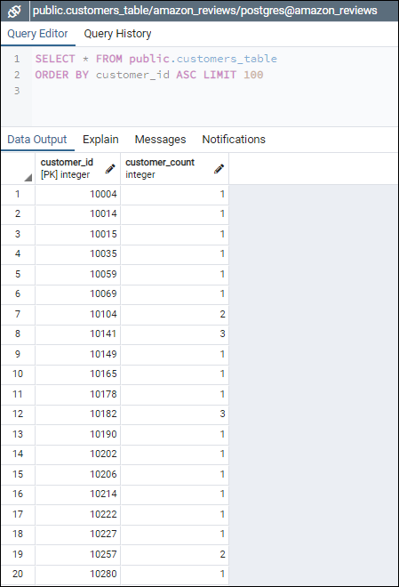
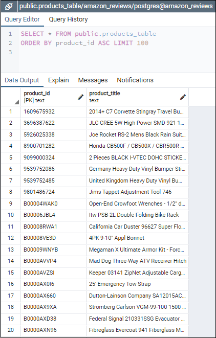
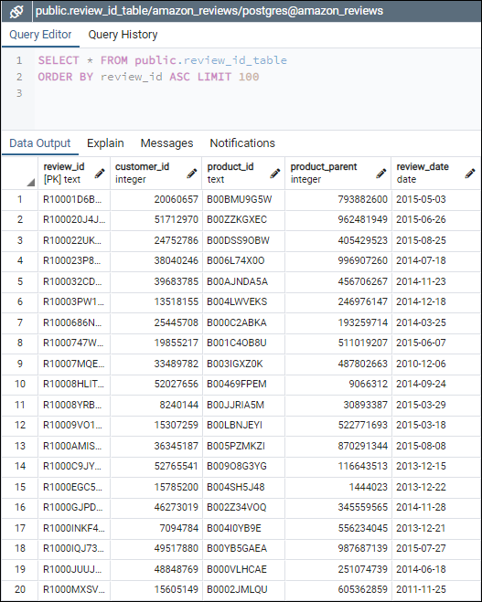
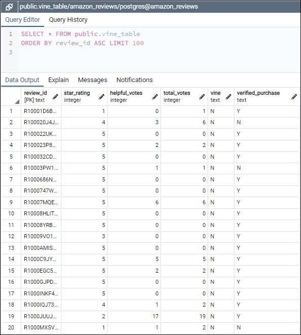
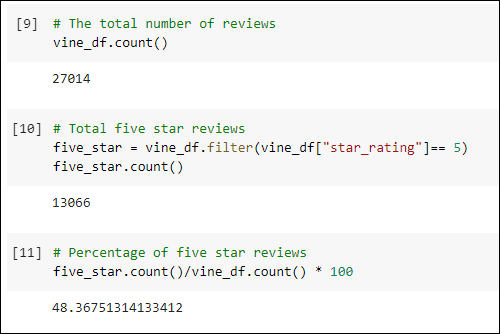
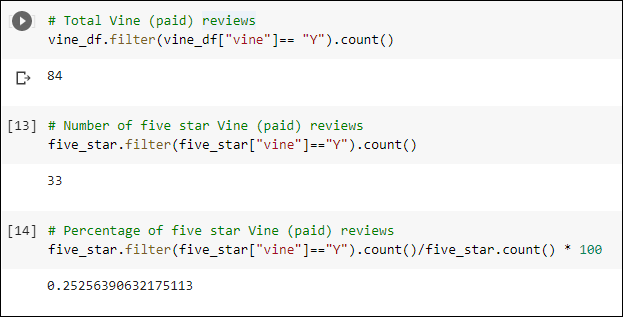
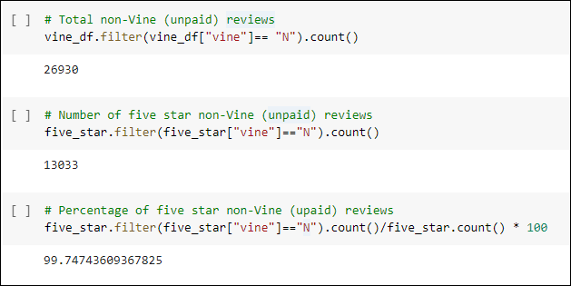

# Amazon_Vine_Analysis

## Project Overview

Analyzing Amazon reviews written by members of the paid Amazon Vine program - a service that allows manufacturers and publishers to receive reviews for their products. Using the ETL process, SQL & PySpark we will determine if there is any bias toward favorable reviews from Vine members in the dataset.

## Resources

- Data Source: [Automotive Reviews](https://s3.amazonaws.com/amazon-reviews-pds/tsv/amazon_reviews_us_Automotive_v1_00.tsv.gz)
- Software/Applications: Amazon Web Services, pgAdmin 4.28,  Google Colab 

## Results

### Performing ETL on Amazon Product Reviews

#### Customers Table

  

#### Products Table

  

#### Review ID Table

  

#### Vine Table

  

### Vine Review Analysis

Based on analyis of Automotive product reviews with 20+ total votes:

  

- There is total of **27,014** Automotive product reviews.
- **48.37%** of product reviews are 5 star for a total of **13,066** reviews

  

- **0.31%** of product reviews are from the Vine program for a total of **84**reviews.
- **0.25%** of Vine Reviews have a 5-star rating for a total of **33** reviews.

  

- **99.69%** of product reviews are not from the Vine program for a total of **26,930** reviews.
- **99.75%** of non-Vine reviews have a 5-star rating for a total of **13,033** reviews.

## Summary
- Based on the result there is evident positivity for bias in the vine Vine reviews as only 0.25% of vine reviews have a 5-star rating.
